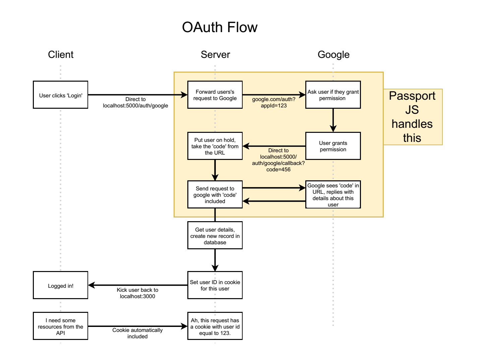

# Passport.js
* [Official](http://www.passportjs.org/)
* [GitHub](https://github.com/jaredhanson/passport)
## 缺點
OAuth flow非常不明確，需要有完整Map搭配使用。

## 安裝

* Passport分為Passport.js和Passport strtegy，至少要裝passport.js和一個strtegy
```
npm install --save passport passport-google-oauth20
```

